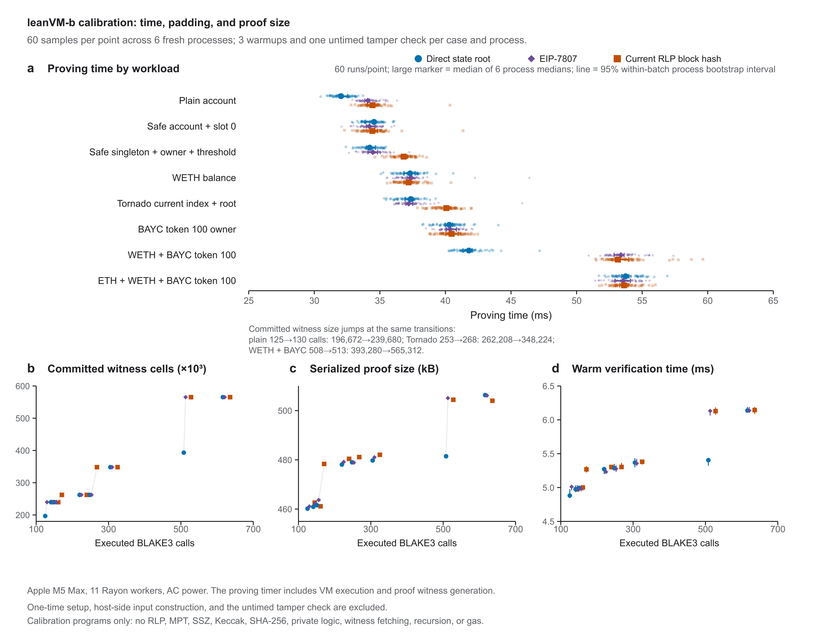

# leanVM-b state anchor benchmark

Real Ethereum account-and-storage proofs through three anchor paths, with all Keccak hashing, RLP validation, trie traversal, and SSZ branch hashing enforced inside leanVM-b.

The claim is the Safe account `0xb235f9b71000a39c25476f7ba40aaa3763287685`'s slot 0 value at mainnet block **25,939,968**. All nine proof runs verified, three per anchor. The three saved proofs also verified in separate processes without the witness files, and the VM rejected all 76 altered-witness cases.


**Real proof results.** Every measured run is shown. The RLP and SSZ paths execute about 13% more instructions than the direct path, while commitment size is identical. Thin lines show observed ranges and black ticks show medians, not confidence intervals. [Figure gallery, full captions, and PDF/SVG/600 dpi PNG downloads](real_state/figures/README.md).

| Anchor | VM cycles | Median proving time | Proof bytes |
| --- | ---: | ---: | ---: |
| Direct state root | 7,401,439 | 19.414 s | 834,848 |
| Historical RLP block hash | 8,370,523 | 19.964 s | 833,632 |
| Proposed EIP-7807 SSZ root | 8,385,857 | 22.247 s | 835,136 |

These initial timings were collected on an Apple M5 Max with 128 GiB RAM, on battery power, using eleven Rayon workers. The ranges overlap substantially, so they do not establish a reliable ranking between anchors.

The programs prove the complete inclusion claim for a **fixed public encoding shape**. They validate every encoding boundary and compute every required hash, but do not measure a general parser discovering arbitrary proof shapes at runtime. The SSZ case uses a hypothetical EIP-7807 summary containing the real state root. It is not a historical mainnet SSZ block. This is a state inclusion proof, with no private transaction or witness-hiding claim.

Read the [real proof report](real_state/README.md) for the exact statement, trust boundary, measured ranges, and reproduction commands. It includes [saved proofs](real_state/proofs/), [raw results](real_state/results/), [program hashes](real_state/programs.json), and the [guest relation](real_state/statement.py).


**Proof paths.** Each anchor authenticates the same state root before the VM verifies the account and storage trie paths. The SSZ summary is hypothetical; its state root is from the mainnet fixture. [Full caption and vector exports](real_state/figures/README.md#figure-1--one-real-claim-through-three-anchor-paths).

## Verify locally

```bash
git clone https://github.com/soispoke/leanvm-b-state-anchor-benchmark.git
cd leanvm-b-state-anchor-benchmark
python3 -m venv .venv
source .venv/bin/activate
python -m pip install -r requirements-lock.txt
python -m real_state.verify_artifacts
python -m unittest discover -s real_state -p 'test_*.py' -v
```

The commands above check the evidence and native tests. With Rust installed, regenerate the programs and verify the saved proofs cryptographically:

```bash
python -m real_state.run setup
python -m real_state.run generate
python -m real_state.verify_artifacts --generated
RAYON_NUM_THREADS=11 python -m real_state.run verify --saved-proof real_state/proofs
```

The implementation uses [leanVM-b commit `8494c5d`](https://github.com/leanEthereum/leanVM-b/tree/8494c5d5df323f2b97ed89272942a4bee6247078) with a small patch exposing its existing witness input API. Its ISA and proof constraints are unchanged. See the [reproduction details](real_state/README.md#reproduce) to generate new proofs. Live proving used up to about 39 GiB of peak memory footprint; CI regenerates the programs and verifies the saved proofs without running these large proving jobs.

## Earlier BLAKE3 calibration

The original experiment models state anchor work using synthetic serial BLAKE3 chains. Its two batches establish that small differences in hash count can have almost no timing effect until they cross a committed witness padding boundary.

| Observation | Original batch | Independent repeat |
| --- | ---: | ---: |
| Proving spread across 141, 146, and 161 hashes | 0.71% | 0.99% |
| Proving increase from 508 to 513 hashes | 29.90% | 27.74% |
| Median proving shift across all 24 workloads | Reference | +3.52% |

The 508 → 513 jump appeared in all 12 process sessions across both batches. Each batch contains 1,440 samples: 24 workloads, six fresh processes, and ten measured passes per process after three warmups per workload. These calibration programs execute BLAKE3 chains; the real state proof implementation is the separate experiment above.



Both calibration batches used the same recorded machine, OS, toolchain, leanVM-b commit, dependency lock, source hashes, AC power, threads, warmups, repetitions, and workload order. The original run did not record temperature, CPU frequency, system load, or power mode. Its intervals describe variation **within each batch**. Exact environmental equivalence cannot be proven.

The original evidence remains preserved:

- [Calibration report](REPORT.md), [independent repeat report](reruns/2026-09-09-independent-repeat/README.md), and [comparison CSV](reruns/2026-09-09-independent-repeat/comparison.csv).
- [Original timing CSV](timing-results.csv) and [raw transcript](timing-raw.txt).
- [Repeat timing CSV](reruns/2026-09-09-independent-repeat/timing-results.csv) and [raw transcript](reruns/2026-09-09-independent-repeat/timing-raw.txt).
- [Mainnet fixture](fixtures/mainnet-0x18bd000.json), [structural counts](usecase-results.csv), and [figure captions](figures/README.md).

Run `python verify_evidence.py` to check the original hashes, 13 MPT tests, eight structural cases, 24 recorded chain runs, all 2,880 timing samples, summaries, and SVG figures. [REPRODUCING.md](REPRODUCING.md) covers the original calibration. [PROVENANCE.md](PROVENANCE.md) explains both experiments' evidence preservation.
