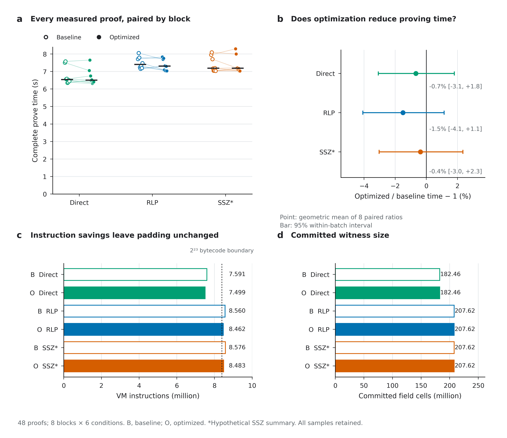

# leanVM-b owner-binding benchmark

How much does the choice of state anchor add to proving that a note belongs to an Ethereum account? This benchmark opens **`H = Keccak256(owner_addr || secret)`** and verifies that same address's account and storage proof inside leanVM-b, including parsing and hashing.

**Both block anchors add about 9% proving time over a direct state root. This batch does not resolve a difference between RLP and SSZ.**

| Anchor | Median proving time | Paired change vs direct (nominal 95% interval) |
| --- | ---: | ---: |
| Direct state root | 6.41 s | Reference |
| RLP block hash | 7.05 s | +9.1% [+8.6, +9.6] |
| Hypothetical SSZ summary | 7.03 s | +8.8% [+8.2, +9.5] |

These are **240 measured proofs, 80 per anchor**, collected in randomized rounds on one Apple M5 Max with 11 workers and AC power. All proofs verified. Early timing drift questions the independence assumption behind the nominal intervals; they do not establish precision across batches or machines.



All three paths use the same mainnet account and storage fixture, the same compiler optimizations, and Keccak state tries. The SSZ summary changes only header authentication. Owner privacy and transaction authorization are outside the measured relation; the pinned backend has no implemented zero-knowledge layer.

- [Results and exact statement](owner_state/README.md)
- [Figures, captions and vector downloads](owner_state/figures/README.md)
- [Verify and reproduce](REPRODUCING.md)
- [Evidence and provenance](PROVENANCE.md)

## Quick check

With Python 3.13, from the repository root:

```bash
python3 -m venv .venv
source .venv/bin/activate
python -m pip install -r requirements.txt
python -m owner_state.verify_artifacts
```

The check uses committed evidence and needs no Ethereum RPC access. [Reproduction](REPRODUCING.md) also covers tests, regenerated programs, saved-proof verification and a new measurement batch.
