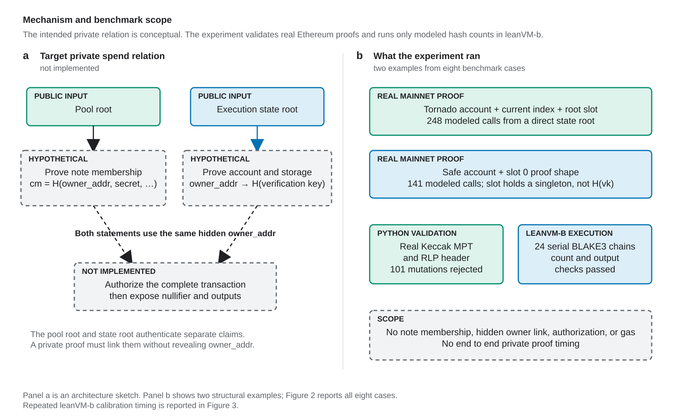
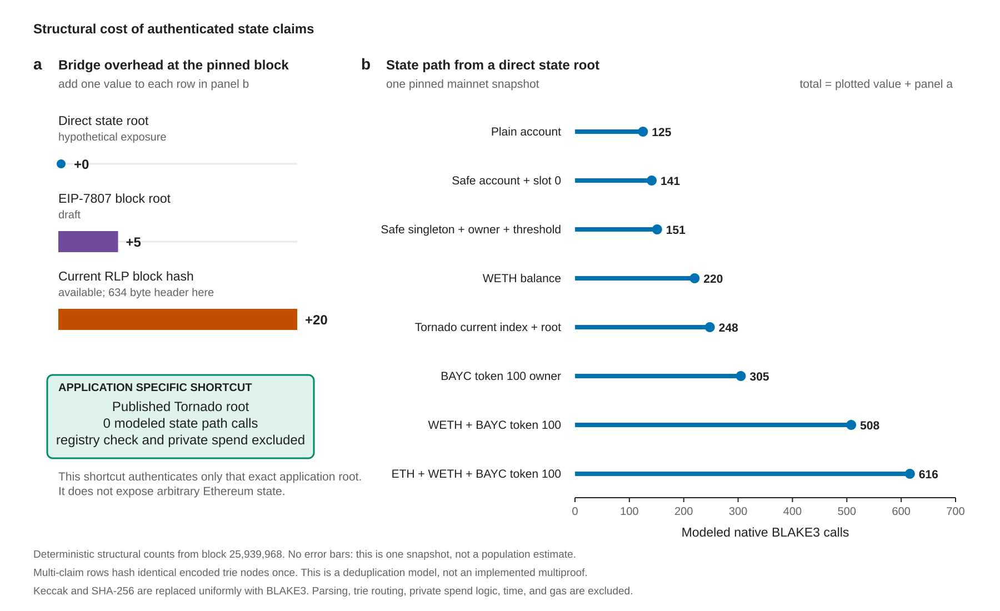
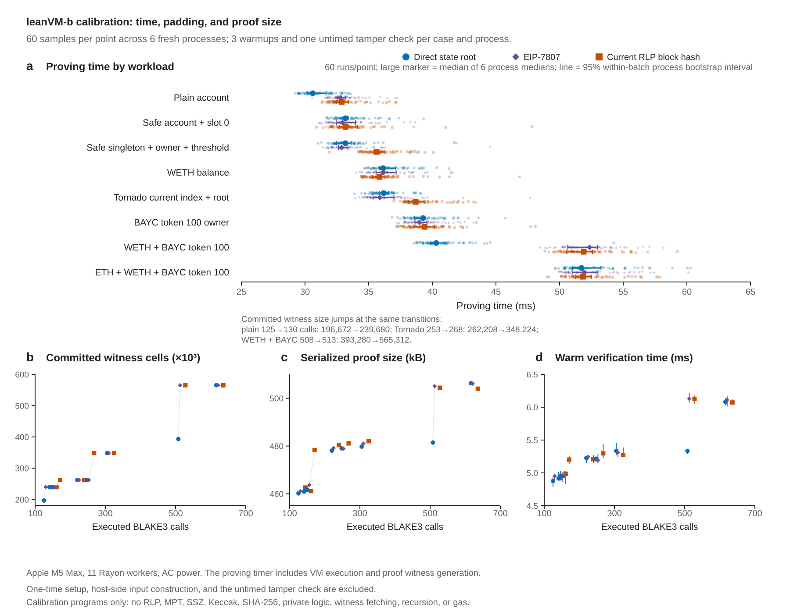

# State Anchor Proof Paths with Real Mainnet Fixtures

## TL;DR

The corrected benchmark isolates state anchoring and uses six validated mainnet proofs. Authenticating one account and one fixed storage word takes 141 modeled leanVM-b BLAKE3 calls from a direct state root, 146 from an EIP-7807 block root, or 161 from the current RLP block hash. Other direct state root examples range from 125 calls for an account record to 616 for native ETH, WETH, and BAYC together. A direct application root is much cheaper, but only for a protocol that publishes the exact root it needs. The benchmark reports two batches of 1,440 leanVM-b timing samples for synthetic serial BLAKE3 programs. Both reveal the same padding costs, but they are not end to end private proof times.

## Audit verdict

The artifact is sound for two narrow claims. It validates a pinned Ethereum state snapshot and derives reproducible structural counts under one uniform hash model. It also measures steady state proving and verification time for serial BLAKE3 calibration programs on one machine. It is not an end to end benchmark of a private ownership proof, verification gas, or `MAX_VERIFY_GAS`.

The Rust harness proves serial BLAKE3 chains with the counted lengths. It does not parse RLP, verify an SSZ branch, traverse the state trie, hide `owner_addr`, prove note membership, or verify transaction authorization. Those parts must be implemented inside leanVM-b before the work can support an end to end performance claim or a comparison with other proving systems.

The pinned [leanVM-b](https://github.com/leanEthereum/leanVM-b) revision describes itself as highly experimental, and the repository now says development has moved to leanVM. This run checks the benchmark program against that pinned implementation. It does not establish the cryptographic soundness or production readiness of the VM itself.

## Figures



**Figure 1. Intended mechanism and measured scope.** Panel a shows the conceptual relation. Panel b shows two examples from the actual structural experiment, which validates unrelated Tornado Cash and Safe mainnet proofs and executes modeled BLAKE3 chains. Figure 2 reports all eight cases. The benchmark does not join the examples or implement a hidden owner, note membership, authorization, nullifiers, or outputs.



**Figure 2. Structural results.** Panel a isolates anchor overhead at the pinned block. Panel b shows direct state root path counts for the exact fixtures. Each panel a value is added once to a panel b row. The application shortcut authenticates only the published Tornado root. Multi-claim rows hash identical encoded trie nodes once; this is a deduplication model, not an implemented multiproof. Real Keccak and SHA-256 costs, parsing, trie routing, private spend logic, time, and gas are excluded.



**Figure 3. Measured leanVM-b calibration.** Panel a shows all 60 proving times per workload from the first batch, the median of six process medians, and a 95 percent within-batch process bootstrap interval across those medians. The remaining panels show committed witness cells, serialized proof size, and warm verification time. The independent repeat is reported below. These are measurements of serial BLAKE3 calibration programs, not state proof or private transaction proving times.

## Question

The benchmark asks how much modeled hash work is needed on the Ethereum state branch before a private proof can use a state value:

```text
block hash -> state root -> account -> storage -> private predicate
```

It compares four possible public anchors:

1. The current RLP block hash.
2. An [EIP-7807](https://eips.ethereum.org/EIPS/eip-7807) SSZ block root.
3. A directly exposed execution state root.
4. A directly exposed application root, such as a privacy pool root published through recent roots.

The private predicate is deliberately excluded. Its cost depends on the application, and including one chosen authorization tree would make the percentages depend on that choice.

## Uniform hash model

The base relation is leanVM-b's 64 to 32 byte `BLAKE3` opcode:

```text
H(left, right) = BLAKE3(left || right)
```

A fixed pair hash, such as an SSZ parent or Solidity mapping key, takes one call. Variable byte strings use leanVM-b's length-bound chain, where each call carries the previous 32 byte state and absorbs 32 new bytes. An RLP node of 532 bytes therefore takes 17 calls.

The real Ethereum proofs are still checked with Keccak against the actual state root. BLAKE3 is used only to compare proof structure without mixing the costs of Keccak, SHA-256, and a proof-friendly hash.

## Mainnet cases

All fixtures use mainnet block 25,939,968 (`0x18bd000`), block hash `0xa6f6dd4116ea6caf55549f1617943485fc9e56c164d68e21ebd32d2bdcb39863`, and state root `0xae8de9c5c3a339068cafbaa4687bad7bc66f63dc5a04cd65c468677675831ce5`.

| Case | What the proof reads |
| --- | --- |
| Plain account | One ordinary account record with a native ETH balance |
| Account plus one storage word | One smart account and one fixed storage word, the proof shape needed to retrieve a verification key hash |
| WETH balance | The WETH contract account and one `balanceOf` storage slot |
| BAYC ownership | The BAYC contract account, array length, token index, and owner value used by `ownerOf(100)` |
| Safe owner and threshold | The Safe account, singleton, one owner link, and threshold |
| Tornado recent root | The Tornado Cash Classic 0.1 ETH pool, current root index, and selected root |
| WETH and BAYC | The WETH and BAYC claims for the same holder |
| Native ETH, WETH, and BAYC | The holder account plus both contract claims |

The account plus storage word case uses the account proof and fixed slot 0 proof from the Safe fixture as a real mainnet proof shape. The stored word is the Safe singleton address, not an actual verification key. A production experiment should repeat the measurement with a purpose-built account that stores a canonical verification key hash in that slot.

The combined cases use `0x7bf1e657fdb7410c83ff70034b15947d95cbf675`, which held 0.1 WETH and BAYC token 100 at the pinned block. Its account also had a native ETH balance. It has an EIP-7702 delegation designator, so the separate plain account case uses `0x28C6c06298d514Db089934071355E5743bf21d60`.

## Results

The numbers below are state anchor hash calls. They do not include the private authorization, ownership, balance threshold, membership, nullifier, or transaction binding logic.

| Use case | Direct application root | Direct state root | EIP-7807 block root | Current RLP block hash |
| --- | ---: | ---: | ---: | ---: |
| Plain account | N/A | 125 | 130 | 145 |
| Account plus one storage word | N/A | 141 | 146 | 161 |
| WETH balance | N/A | 220 | 225 | 240 |
| BAYC token 100 owner | N/A | 305 | 310 | 325 |
| Safe owner and threshold | N/A | 151 | 156 | 171 |
| Tornado recent root | 0 | 248 | 253 | 268 |
| WETH and BAYC | N/A | 508 | 513 | 528 |
| Native ETH, WETH, and BAYC | N/A | 616 | 621 | 636 |

A zero in the Tornado row means zero state anchoring work after that exact root has been published through a canonical recent root mechanism. It does not mean a Tornado spend proof is free. Root publication, the EVM recent root check, note membership, the nullifier, and transaction authorization are outside this table.

A direct application root is marked N/A for existing ETH, ERC-20, NFT, and Safe state because those applications do not publish the exact accumulator needed by the claim. Adding such an accumulator would change the application and its trust or update model.

## What changes with each anchor

The current header fixture is 634 RLP bytes, which takes twenty byte absorption hashes. Under EIP-7807, `state_root` is field 2 of the 18 field `ProgressiveContainer`. Its branch to the block root takes four progressive tree hashes plus the active fields mix-in required by [EIP-7495](https://eips.ethereum.org/EIPS/eip-7495), for five pair hashes in total.

Those costs are paid once per referenced state snapshot, not once per account or storage slot. This gives two fixed differences across every case:

- EIP-7807 saves fifteen hashes relative to the current RLP header.
- Exposing the state root directly saves five more hashes relative to EIP-7807.

The percentage depends on the claim. The RLP to SSZ saving ranges from 10.3 percent for the plain account to 2.4 percent for the three-position case. The SSZ to direct state saving ranges from 3.8 percent to 0.8 percent. As a proof reads more state, the fixed header shortcut matters less.

The larger shortcut is application specific. For the Tornado root, publication through a recent root registry removes the complete 248 hash state path. That result does not generalize to an arbitrary ETH balance or portfolio unless another system maintains a suitable root for those claims.

## Shared nodes

Several claims against one state root can share proof nodes. The benchmark reports both the sum of the RPC paths and a simple deduplicated model that hashes each identical RLP node once.

| Use case | Path sum | Unique node model | Saved |
| --- | ---: | ---: | ---: |
| Plain account | 124 | 124 | 0 |
| Account plus one storage word | 139 | 139 | 0 |
| WETH balance | 217 | 217 | 0 |
| BAYC ownership | 334 | 300 | 34 |
| Safe owner and threshold | 164 | 146 | 18 |
| Tornado recent root | 262 | 245 | 17 |
| WETH and BAYC | 551 | 500 | 51 |
| Native ETH, WETH, and BAYC | 675 | 607 | 68 |

These rows count only hashes over encoded trie nodes. The final anchor totals also include the secure trie key hashes and the mapping or dynamic array key derivations needed by each case. Identical hash inputs are computed once. In the BAYC proof, `keccak(slot 2)` is both the storage trie key for the array length and the dynamic array base.

Exact node deduplication is a simple multiproof proxy, not an implemented optimal Ethereum multiproof. It shows the reuse available in these fixtures. A production circuit still needs to route each key to the right value and enforce every trie rule.

## Validation

The analyzer performs the semantic checks that the first harness lacked:

- It reconstructs and verifies all six account proofs and all nine storage proofs using the real Keccak Merkle Patricia trie rules.
- It RLP encodes the 21 field header and reproduces the pinned block hash.
- A second public mainnet RPC returned the same block hash and state root.
- It checks that WETH `balanceOf`, BAYC `ownerOf(100)`, Safe getters, and Tornado `getLastRoot` match raw storage and the authenticated proof values.
- It recomputes every mapping and array slot used by the cases.
- It changes the state root and account key, then changes one byte in each of the 99 proof node occurrences. All 101 negative checks fail.
- Thirteen focused MPT tests cover canonical embedded and hashed children, the exact 32 byte boundary, invalid raw child references, empty extension paths, empty leaf values, adjacent extension or leaf nodes, and branches that should have been collapsed.
- A separate Rust harness runs every direct state, SSZ block, and RLP block total as a synthetic leanVM-b hash chain. Every chain proof verifies, changing its claimed output is rejected, and each program executes the expected number of BLAKE3 calls.

This validates the fixtures and the structural counts. The analyzer is scoped to these inclusion proofs and is not presented as a general Ethereum MPT implementation.

For this synthetic serial chain program, the cycle count is `20 + 24N`, where `N` is the number of BLAKE3 calls. This relation does not describe an arbitrary leanVM-b program, and these runs do not execute RLP or trie semantics.

| Use case | Direct state root | EIP-7807 block root | Current RLP block hash |
| --- | ---: | ---: | ---: |
| Plain account | 3,020 | 3,140 | 3,500 |
| WETH balance | 5,300 | 5,420 | 5,780 |
| BAYC ownership | 7,340 | 7,460 | 7,820 |
| Account plus one storage word | 3,404 | 3,524 | 3,884 |
| Safe owner and threshold | 3,644 | 3,764 | 4,124 |
| Tornado recent root | 5,972 | 6,092 | 6,452 |
| WETH and BAYC | 12,212 | 12,332 | 12,692 |
| Native ETH, WETH, and BAYC | 14,804 | 14,924 | 15,284 |

The direct application root case has zero state anchoring hashes, so there is no anchor program to run. The private proof remains outside the comparison.

## Repeated leanVM calibration

The timing run measures all 24 serial BLAKE3 workloads in six fresh processes. Each process prepares every program, performs three warmups and one untimed tamper check per workload, then records ten shuffled passes. This gives 60 proving and verification measurements per workload, or 1,440 samples in total.

The reported center is the median of the six process medians. The 95 percent interval comes from 20,000 cluster bootstrap resamples over processes, so repeated runs within one process are not treated as independent replicates. All six processes ran sequentially, so the interval describes variation within this short batch. It does not estimate variation between separate benchmark runs. The proving timer includes VM execution and proof witness generation. It excludes program and input construction, one-time BLAKE3 setup, warmups, proof verification, and the tamper check.

The main result is that leanVM-b padding can matter more than a small difference in executed hashes. The 141, 146, and 161 call programs all use a 256 call BLAKE3 domain, commit 239,680 witness cells, and have overlapping proving times around 33 ms. In contrast, moving from 508 to 513 calls raises the committed witness from 393,280 to 565,312 cells, and the median rises from 40.31 ms to 52.36 ms. Total committed witness size has padding steps beyond the BLAKE3 table, so it is the more complete explanation of the timing jumps.

| Calibration program | Calls | Padded domain | Proving time, median ms | 95% within-batch process bootstrap interval |
| --- | ---: | ---: | ---: | ---: |
| Plain account, direct state root | 125 | 128 | 30.61 | 30.16 to 31.65 |
| Plain account, EIP-7807 block root | 130 | 256 | 32.78 | 32.56 to 33.16 |
| Account plus storage word, direct state root | 141 | 256 | 33.18 | 33.11 to 33.39 |
| Account plus storage word, EIP-7807 block root | 146 | 256 | 32.95 | 32.49 to 33.96 |
| Account plus storage word, current block hash | 161 | 256 | 33.19 | 32.69 to 34.10 |
| WETH plus BAYC, direct state root | 508 | 512 | 40.31 | 39.84 to 41.00 |
| WETH plus BAYC, EIP-7807 block root | 513 | 1,024 | 52.36 | 50.64 to 52.97 |

An independent same-day repeat used the same machine, operating system, Rust and Cargo versions, leanVM-b commit, dependency lock, benchmark sources, AC power, thread count, warmups, repetitions, and shuffled case order. Every deterministic field matched, including cycles, committed cells, memory use, proof size, and all 1,440 sample identities. The 508 to 513 call transition raised proving time by 29.90 percent in the first batch and 27.74 percent in the repeat. It appeared in all twelve process sessions. The 141, 146, and 161 call programs remained one timing plateau in both batches.

Absolute proving medians in the repeat were consistently higher, with a median shift of 3.52 percent across the 24 workloads. Verification medians shifted by 0.90 percent. The original run did not record temperature, CPU frequency, system load, or power mode, so exact ambient equivalence cannot be established. This common batch shift is why the intervals above must not be read as general machine repeatability intervals. The complete repeat and comparison are in [the independent repeat report](reruns/2026-09-09-independent-repeat/README.md).

Across all workloads, serialized proofs range from about 460 to 506 kB and warm verification medians range from about 4.9 to 6.1 ms. These dimensions also change when committed witness size steps up. The complete summaries are in [timing-results.csv](timing-results.csv), and every raw observation is in [timing-raw.txt](timing-raw.txt).

These results are machine specific. They were collected on an Apple M5 Max with 128 GB memory, 11 Rayon workers, AC power, macOS 26.5, and Rust 1.97.1. The raw transcript records the leanVM-b revision, timing program, runner, analysis script and dependency lock hashes, compiler, hardware, operating system, power state, and thread count.

## Earlier 400-chain calibration

The original `state_anchor_bench.rs` remains useful as a calibration. At leanVM-b commit `8494c5d5df323f2b97ed89272942a4bee6247078`, its synthetic loop used about 24 VM cycles per native BLAKE3 call.

Its proving time, proof size, and memory numbers should not be applied to the use cases above. It concatenated 400 paths into one serial chain, committed one output, and crossed leanVM-b padding boundaries differently by batch size. It did not execute an RLP parser, trie traversal, SSZ branch, or application predicate.

## Limits

This is still a structural model plus a synthetic timing calibration, not a production proof benchmark. It does not price RLP parsing, nibble traversal, branch selection, value comparisons, witness retrieval, or the private predicate. It does not implement a BLAKE3 state trie, recursive aggregation, onchain verification, or EVM gas. Current Ethereum uses Keccak for the state trie and block header, while EIP-7807 uses SHA-256 for the SSZ block root and does not change the state trie.

Trie shapes vary across blocks, accounts, and slots. The six fixtures show obvious cases and one real composition example, not a distribution over Ethereum state. The next high-value experiment would implement full MPT semantics in the proof VM or repeat the fixture sweep over many blocks and addresses. That is needed before predicting production proving time or deciding a `MAX_VERIFY_GAS` value.

## Reproduction

See [REPRODUCING.md](REPRODUCING.md) for environment setup, evidence verification, figure generation, and live leanVM-b runs. All recorded results and the earlier 400-chain calibration are included.
