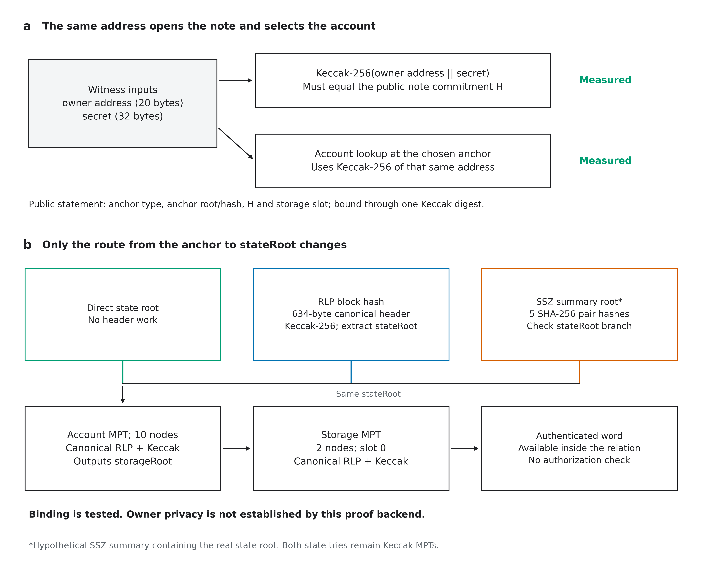
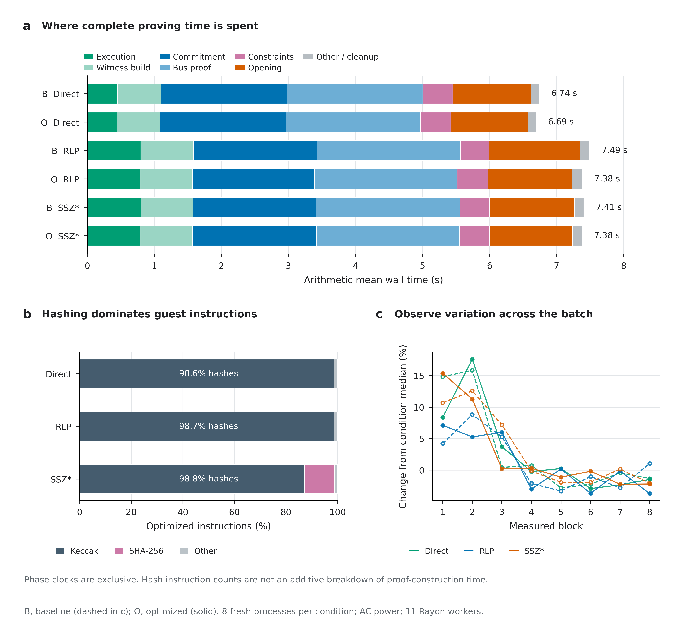

# Note-owner binding through three state anchors

This experiment opens `H = Keccak256(owner_addr || secret)` and authenticates the **same address's account and storage word** inside leanVM-b. It compares a direct state root, an RLP block hash and a hypothetical SSZ summary root. The selected compiler optimization preserves the relation and all hash algorithms.

**Binding is implemented; owner privacy is not established.** The pinned backend lacks a zero-knowledge layer. Signature verification, leanSPHINCS and recursive authorization, item (ii), remain outside this experiment. See the [privacy inspection](PRIVACY.md).



## Results

The complete measurement table and figures are generated from the collection selected in [evidence.json](evidence.json). The original [state-lookup measurements](../real_state/README.md) remain preserved as an earlier, different relation.

**Hash optimization removes 1.08–1.22% of instructions, but a proving-speed improvement is not established.** Every optimization interval includes no change. Positive timing changes below mean slower.

| Anchor | Baseline median | Optimized median | Paired time change (95% interval) |
| --- | ---: | ---: | ---: |
| Direct state root | 6.54 s | 6.51 s | -0.7% [-3.1, +1.8] |
| RLP block hash | 7.40 s | 7.31 s | -1.5% [-4.1, +1.1] |
| SSZ summary* | 7.19 s | 7.19 s | -0.4% [-3.0, +2.3] |

The complete September 11 restart contains **48 measured proofs across eight randomized blocks**, plus six warmups, on an Apple M5 Max with eleven Rayon workers and AC power. All proofs verified. Observations span **6.32–8.29 s**, with residual drift during the batch; the intervals describe paired differences within this batch, not general machine variability.

For optimized programs, mean VM execution is **0.44–0.79 s** and witness construction **0.64–0.78 s**. The remaining **79–84%** of complete proving time is proof work and cleanup. Keccak and SHA account for **98.6–98.8% of guest instructions**, but their proof-construction costs cannot be separated by subtracting standalone hash timings.

*The SSZ summary is hypothetical and retains the same Keccak state tries. A secondary paired SSZ/RLP comparison also does not establish an SSZ timing advantage.


### Optimized phase costs

Arithmetic means in seconds; rows add to the complete prove call.

| Anchor | Execution | Witness build | Remaining prove work and cleanup | Complete prove call |
| --- | ---: | ---: | ---: | ---: |
| Direct state root | 0.443 | 0.644 | 5.607 | 6.694 |
| RLP block hash | 0.790 | 0.780 | 5.812 | 7.382 |
| SSZ summary* | 0.791 | 0.777 | 5.813 | 7.380 |

### Proof size and process memory

Verification medians below are measured immediately after proving. Independent witness-free verification is recorded separately. Peak footprint covers the complete process, including loading and checks.

| Anchor | Proof bytes | Median verification | Maximum peak footprint |
| --- | ---: | ---: | ---: |
| Direct state root | 834,752 | 148.8 ms | 38.77 GiB |
| RLP block hash | 835,712 | 301.6 ms | 42.07 GiB |
| SSZ summary* | 836,384 | 296.4 ms | 41.70 GiB |

All 54 proofs passed their public-input and serialized-proof tamper checks. The six saved proofs also verified in fresh processes containing no witness files. All 85 altered-witness checks and 49 native/compiler/measurement tests passed. [Raw evidence and source hashes](evidence.json) preserve these checks.




## Exact statement

The public inputs are the anchor type, anchor root or block hash, note commitment `H`, and storage slot. The VM binds their fixed-width encoding through two public field elements containing:

```text
Keccak256("LVMOWNER1" || mode:u8 || anchor:32 || H:32 || slot:32)
H = Keccak256(owner_addr:20 || secret:32)
```

The witness supplies the address, secret, account proof, storage proof and stored word, plus a header or SSZ branch where needed. The same address wires feed both the note hash and the secure account-trie key. The authenticated account's `storageRoot` anchors the storage lookup. The slot wires feed both the secure storage key and public statement, and the decoded stored value must equal the supplied witness word. No host-provided hash digest is trusted.

The account is Safe `0xb235f9b71000a39c25476f7ba40aaa3763287685`, slot `0`, at Ethereum mainnet block **25,939,968**. Its singleton address is a stand-in for a stored verification key hash; this experiment does not claim it is a real verification key. The demonstration secret is the public byte sequence `00, 01, …, 1f`, and the note commitment is `0x644730db4e62e76585160679508e0fec9df6a75a4e1fe9ce9c9d014b03310fe5`. These are benchmark fixtures, not private user data.

All canonical RLP checks, secure trie key hashing, account and storage traversal, header hashing or SSZ branch verification, commitment opening and public-input hashing execute as constrained VM instructions. The relation retains the original **fixed public encoding shape**, including node lengths and RLP layouts. It is not a general variable-length Ethereum state verifier. The SSZ branch contains the real state root, but its summary is hypothetical; both state tries remain Keccak MPTs. See the [original profile and fixture derivation](../real_state/README.md).

## What was optimized

The baseline and optimized conditions prove identical public statements. Common-subexpression elimination reuses identical operations within each hash. Dead-code elimination removes unused calculations, mainly unneeded outputs of Keccak's last permutation. Every write to an initialized cell remains a constraint root, preserving Booleanity, equality checks, conflicting-write rejection and public-input binding. Compilation decisions depend on public shape and wire identities, not witness values.

This removes **1.08–1.22% of whole-program instructions**. No baseline/optimized pair crosses a padded table boundary. Other candidates, including two SHA carry formulas, are recorded in the [screening report](screening/README.md). A reduction in multiplications alone is not a demonstrated speedup when it increases XOR work or leaves the same padded proof tables.

Adding the note commitment also changes the comparison with the earlier state-only relation: the RLP and SSZ programs now cross the `2^23` memory and bytecode domain boundary, while direct state remains below it. Their committed witness size is **207,621,052 field cells**, versus **182,455,228** for direct state. This is a property of this fixture, relation and backend padding. It is not a universal cost ratio between anchors.

## Measurements and interpretation

The [experiment contract](CONTRACT.md) fixed the analysis before collection. Each of six conditions has one warmup in a fresh process and eight measured fresh processes. Eight blocks cover all conditions in randomized Williams order: one complete six-row balanced cycle and two rows of a second cycle. Every measured sample is retained. The user requested this complete restart before its timing outcome was known. The earlier completed batch remains preserved and is not pooled into these estimates.

The machine is an Apple M5 Max with 128 GiB RAM, running macOS 26.5, Rust 1.97.1, eleven Rayon workers and recorded AC power. The pinned upstream Cargo configuration builds with `-C target-cpu=native`; [build.json](build.json) records the executable, dependency lock, patches and build fingerprint. The collector records power source/settings, load, hardware, toolchain and thermal-warning status before and after every proof. CPU temperature and frequency are **not measured**, and stable settings do not imply constant environmental conditions.

Two initial batches stopped when power changed from AC to battery, during measured proofs 1 and 16 respectively. A third batch was stopped at the user's request after 20 completed measured proofs. All three attempts remain preserved, including completed proofs and warmups. None enters the selected timing estimates. The first complete September 11 batch is also retained as earlier evidence. At the user's request, the entire suite then restarted: setup, generation, native tests, malformed-witness checks, hash diagnostics, all proof warmups/measurements and witness-free verification. The restart uses the same executable and predeclared schedule.

The [restart log](repeats/20260911-full-restart/README.md) records sequential execution with no concurrent local builds, diagnostics or figure generation during proof collection. Each timing stage required three consecutive snapshots at least 90% CPU idle on AC power, spaced by 20 seconds plus probe time. Immediately before the proofs, CPU idle was 92.3%, 91.0% and 92.5%. This controls our workload, not every macOS background process or thermal state. Block mean proving time still ranges from 6.88 to 7.84 seconds, so exact equal load is not claimed.

The primary timer covers the complete `prove()` call, including VM execution, witness-table construction, proof construction and return cleanup. Program loading/assembly and verification are timed separately. Witness loading and serialization are outside the prove timer and have no separate timers. The [profiling patch](profile.patch) adds exclusive phase clocks and prints once after internal timing ends. Its work and transcript operations otherwise retain their original order. Phase stacks use arithmetic means so they sum to the mean outer time; absolute headline times use medians.

Each optimization or anchor/direct comparison pairs observations by block. The SSZ/RLP comparisons remain secondary: they were introduced after the earlier batch and retained before this restart, using the same pairing and interval method. The reported ratio is the geometric mean of eight time ratios. Its 95% Student-t interval is computed on their logarithms with seven degrees of freedom. These **within-batch, exploratory, unadjusted** intervals assume approximately independent, normally distributed block log ratios. They do not estimate variability across machines or independent batches, and an interval spanning no change does not establish equivalence.

Hashing is attributed by exact retained instruction counts, with [200 standalone execution diagnostics](diagnostics/20260911-full-restart/report.json) covering every actual hash input length, both selected implementations and the hybrid SHA candidate. Those diagnostics use the same native executable as the selected proof batch, but record environment at batch endpoints rather than per sample. They include witness Booleanity and public-output binding. They are not additive proving costs and are never subtracted from complete proofs: shared tables, padding and polynomial commitments make such subtraction invalid. The earlier non-native diagnostic batch is retained separately.

## Validation and reproduction

Install [requirements-lock.txt](../requirements-lock.txt) in a Python virtual environment. The evidence checker validates hashes, raw logs, phase accounting, the collection schedule, environmental records, saved verification reports, and deterministic analysis outputs. Derived numeric exports use twelve significant digits to avoid platform-specific last-bit differences; raw logs retain their recorded precision:

```bash
python -m owner_state.verify_artifacts
python -m unittest discover -s owner_state -p 'test_*.py' -v
```

With the recorded Rust version installed, regenerate the programs and cryptographically verify the six saved proofs in fresh directories containing only the program, public input and proof:

```bash
python -m owner_state.run setup
python -m owner_state.run generate --variants baseline cse_dce
python -m owner_state.verify_artifacts --generated
python -m owner_state.run verify --run owner_state/results/collect-20260911T074413358669Z
```

`evidence.json` supplies the selected collection path. Setup uses a separate `vendor/leanVM-b-profiled` checkout and leaves the original baseline checkout intact. Generated binaries and programs stay in ignored local directories. The preserved proofs are under the selected collection's `proofs/` directory.

To collect a new batch on macOS with ample memory and AC power:

```bash
python -m owner_state.run negative --variant cse_dce
OWNER_BENCH_BIN="$(python -c 'import json; print(json.load(open("local-runs/owner-state/runner.json"))["binary"])')"
python -m owner_state.microbench --binary "$OWNER_BENCH_BIN" --output local-runs/new-hash-diagnostics
python -m owner_state.run collect --blocks 8 --warmups 1 --variants baseline cse_dce
python -m owner_state.run verify --run owner_state/results/YOUR_COLLECTION
python -m owner_state.analyze --run owner_state/results/YOUR_COLLECTION --diagnostics local-runs/new-hash-diagnostics --output local-runs/new-analysis
python -m pip install -r real_state/figure-requirements.txt
python -m owner_state.plot_figures --run owner_state/results/YOUR_COLLECTION --output local-runs/new-figures
```

The collector rejects failed processes, missing memory metrics, inconsistent provenance, invalid proofs, and power-source or power-settings changes. Permission to read macOS resource counters is required for `/usr/bin/time -l`. Report directories are unique and retained on failure. The 85 malformed-witness checks exercise VM rejection after compilation, not a forged-proof attack; each successful proving process separately checks that an altered public input and mutated serialized proof fail verification.
