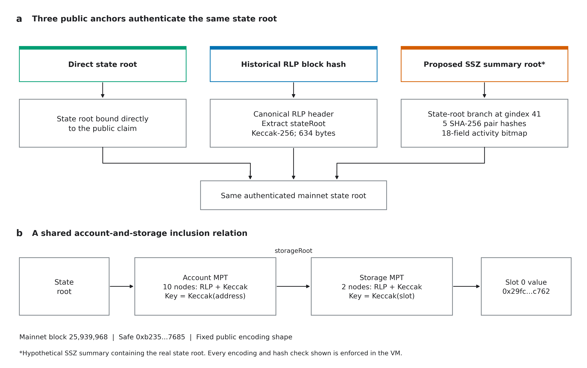
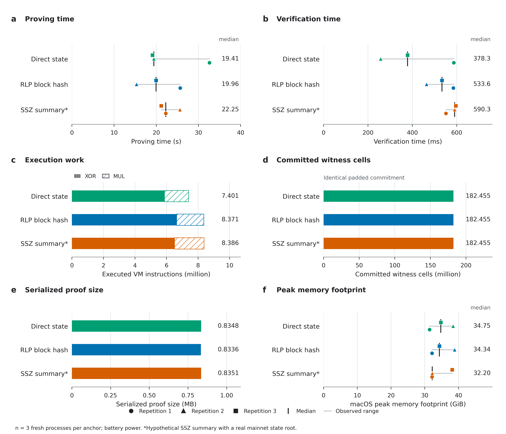

# Real account and storage proofs in leanVM-b

This experiment proves the Safe account's slot 0 value through three anchor paths. The program computes Ethereum Keccak-256, verifies canonical RLP and Merkle Patricia trie links, extracts the account's storage root, verifies the storage value, and binds the claim to its public anchor. The SSZ variant additionally computes the five SHA-256 branch hashes required by EIP-7807's proposed container.



**Figure 1. One real claim through three anchor paths.** Anchor authentication converges on the same mainnet state root. The account proof supplies the storage root used for the storage proof. All depicted encoding and hashing checks run inside leanVM-b for the public fixed shape. [Full caption and PDF/SVG/PNG exports](figures/README.md#figure-1--one-real-claim-through-three-anchor-paths).

The real claim at mainnet block **25,939,968** is:

| Field | Value |
| --- | --- |
| Account | `0xb235f9b71000a39c25476f7ba40aaa3763287685` |
| Storage key | `0x0000000000000000000000000000000000000000000000000000000000000000` |
| Storage value | `0x00000000000000000000000029fcb43b46531bca003ddc8fcb67ffe91900c762` |
| State root | `0xae8de9c5c3a339068cafbaa4687bad7bc66f63dc5a04cd65c468677675831ce5` |
| Historical RLP block hash | `0xa6f6dd4116ea6caf55549f1617943485fc9e56c164d68e21ebd32d2bdcb39863` |

The value is the Safe singleton address. It is the same account-and-storage fixture used in the earlier calibration, not a verification key or a private transaction.

## Measured results



**Figure 2. Real proof measurements.** Individual fresh-process samples, medians, and observed ranges accompany deterministic instruction counts, commitment size, and proof size. Measurements used battery power. These ranges are not confidence intervals. [Full caption, source data, and vector exports](figures/README.md#figure-2--real-proof-measurements).

All nine proof runs verified: three fresh processes per anchor, in orders direct/RLP/SSZ, SSZ/direct/RLP, and RLP/SSZ/direct. No run was discarded and no warmup was excluded. The measurements below are medians, with the full proving range shown.

| Anchor | VM cycles | Proving median (range), s | Verification median, ms | Proof bytes |
| --- | ---: | ---: | ---: | ---: |
| Direct state root | 7,401,439 | 19.414 (19.083–32.616) | 378.262 | 834,848 |
| RLP block hash | 8,370,523 | 19.964 (15.312–25.673) | 533.596 | 833,632 |
| Proposed SSZ root | 8,385,857 | 22.247 (21.180–25.608) | 590.278 | 835,136 |

All three programs commit **182,455,228 witness cells** under the same padded table sizes. The RLP and SSZ variants execute additional real hash and encoding checks, but their proving cost also depends on table padding and the prover's other work. The measurements are too few and too variable to establish a reliable ordering between anchors.

The machine was an Apple M5 Max with 128 GiB RAM, macOS 26.5, Rust/Cargo 1.97.1, and eleven Rayon workers. It was on **battery power**, unlike the original AC-powered calibration. Power settings, load, thermal-status output, source hashes, and toolchain details are in [environment.json](results/environment.json), with an [end record](results/environment-end.json). Actual temperature and CPU frequency were not measured. Maximum macOS peak memory footprint across the runs was 38.85 GiB; this metric is distinct from maximum resident memory, which is also preserved in each log.

See [summary.csv](results/summary.csv), [raw logs](results/), [serialized proofs](proofs/), and [program and proof hashes](programs.json). Recompute the table's source CSV with `python -m real_state.summarize`.

## What the proof enforces

Each input byte enters as eight witness bits. A field multiplication check `x*x = x` constrains each bit to zero or one. Keccak and SHA-256 are implemented using ordinary leanVM-b `XOR`, `MUL`, and `SET` operations. No host hash result is accepted as an unchecked hint, and no new hash precompile or proof constraint is added to the VM.

The account key is `Keccak(address)` and the storage key is `Keccak(slot)`, both computed inside the program. Every proof node is hashed from its supplied bytes. The program checks the root, selects branch children using the computed key nibbles, checks compact-path flags and the complete remaining key fragment, and enforces embedded versus hashed child references. The authenticated account record supplies the storage root for the second proof. The canonical RLP integer in the storage leaf must equal the claimed 32-byte value after left padding.

For the RLP anchor, the program checks the 21-field header encoding, field widths and integer encodings, extracts `stateRoot`, and computes the historical header hash. For SSZ, the real state root is authenticated at generalized index **41**, including the 18-field activity bitmap. The five pair hashes use real SHA-256, including its padding.

The public statement is the 32-byte Keccak digest of this exact concatenation:

```text
"LVMSTATE1" || mode:u8 || anchor:bytes32 || address:bytes20 || slot:bytes32 || value:bytes32
```

`mode` is 0 for direct state, 1 for RLP block hash, and 2 for SSZ block root. The digest is split into two little-endian 128-bit words and checked against leanVM-b's public input. A verifier must use the intended program and independently expected statement, as with any proof of program execution.

## Public encoding shape

[profile.json](profile.json) fixes the encoded node lengths, RLP list/string structure, compact-path parity, and header schema for this experiment. It contains no account address, key, root, child hash, or storage value. Witness contents do not change the compiled program, and branch selection is performed inside it.

RLP interpretation is enforced through canonical re-encoding constraints: every prefix, length, type, and payload boundary must match the supplied bytes. Host parsing discovers the public layout when preparing the experiment, but its verdict is not trusted by proof verification. This is a bounded circuit for the recorded encoding shape. It proves the complete claim for that shape; it does not measure a general parser that discovers arbitrary proof shapes at runtime. Changing the public shape requires a different program.

## The SSZ anchor

The historical block has an RLP hash. Its state root is real, but the SSZ anchor is an explicitly hypothetical test summary, not a historical mainnet SSZ block or a validated execution payload. [ssz-reference.json](ssz-reference.json) records every field's provenance and the synthetic values used where the fixture lacks the proposed payload fields.

The summary root is `0x80072a7509b62a55de86841190368b6fdb868dc017e9d56a1df0e516ff8a4a88`. Its native reference construction and branch agree with `ethereum/remerkleable` at commit `2f0baeef0082d4278acaef7d822deb7009d7db7e`. The schema follows [EIP-7807](https://eips.ethereum.org/EIPS/eip-7807), [EIP-7495](https://eips.ethereum.org/EIPS/eip-7495), and [EIP-7916](https://eips.ethereum.org/EIPS/eip-7916), checked at EIPs commit `d2a64c2d4cc44f2f507577d0ebfb110dcc21d358`.

## Implementation and trust boundary

[hashes.py](hashes.py) implements the Boolean hashes, [statement.py](statement.py) defines the claim, and [circuit.py](circuit.py) emits ordinary VM instructions. The small [API patch](leanvm-witness-api.patch) exposes the existing witness-hint mechanism to bytecode assembled directly. It changes neither the ISA nor proof verification. Witness ranges cannot overwrite the public input, and separate verification runs never load the witness file.

The fixed-shape relation received an independent read-only review, with no blocking constraint gap found. That review and the tests are finite validation, not a cryptographic security audit of the experimental leanVM-b proof system. The experiment proves state inclusion; it does not establish witness hiding or a complete private transaction protocol.

## Validation

The tests compare Boolean Keccak and SHA-256 with independent native implementations and cover padding boundaries and multi-block inputs. Synthetic trie tests exercise dynamic branch selection, compact paths, canonical RLP integers, and embedded-node boundaries. Two different valid witnesses with the same layout produce identical bytecode.

The Rust runner tests witness Booleanity, malformed input rejection, and bytecode substitution. Each live proof is serialized, deserialized, and verified. Changed public inputs and a changed serialized proof are rejected. All **76 malicious witness cases** are rejected after bytecode generation, so they bypass all host-side generation diagnostics and fail inside the actual VM. These are interpreter rejection tests, not attempts to construct forged proofs.

All three saved proofs also passed independent verification in fresh processes containing only `program.bin`, `public.bin`, and `proof.bin`. The first such attempt exposed a Python output-parsing bug despite successful Rust verification. The failed collector report, original collector source, fix, regression tests, and successful repeat remain in the evidence; see [provenance](../PROVENANCE.md).

For timing interpretation, program generation, file loading, and bytecode assembly are separate setup. The proving timer includes guest execution and witness generation. Verification timings start after assembly. These initial runs establish feasibility; they are not confidence intervals or a reliable ranking between anchors.

## Reproduce

From the repository root, use Python 3.11+ and the pinned Python dependencies. The native tests do not require Rust:

```bash
python -m pip install -r requirements-lock.txt
python -m unittest discover -s real_state -p 'test_*.py' -v
python -m real_state.verify_artifacts
```

The remerkleable differential test is optional when that package is absent. To repeat the independent reference check used here, clone `ethereum/remerkleable` at `2f0baeef0082d4278acaef7d822deb7009d7db7e` into `local-runs/remerkleable`, then run the same tests with `PYTHONPATH=local-runs/remerkleable`.

With Rust installed, build the pinned VM and regenerate the three programs:

```bash
python -m real_state.run setup
python -m real_state.run generate
python -m real_state.verify_artifacts --generated
RAYON_NUM_THREADS=11 python -m real_state.run verify --saved-proof real_state/proofs
```

Setup clones the pinned upstream commit, checks its Cargo lock, applies the exact witness-only API patch, and builds the file-driven runner. Generation writes under `local-runs/`, not into the recorded evidence. Verification regenerates the public program and launches a separate process with only the program, public input, and saved proof.

To produce new proofs and run the malicious-witness checks:

```bash
RAYON_NUM_THREADS=11 python -m real_state.run prove
RAYON_NUM_THREADS=11 python -m real_state.run negative
```

Use `--mode direct`, `--mode rlp`, or `--mode ssz` to select one path, `--repeats` for more fresh processes, and `--measure-memory` for macOS resource measurement. Live proving used up to about 39 GiB of peak memory footprint in these runs. These are portable commands, but other hardware and toolchains can produce different timings. This implementation uses the initial, explicit Boolean hash lowering; it makes no claim of an optimized Keccak or SHA-256 implementation.
