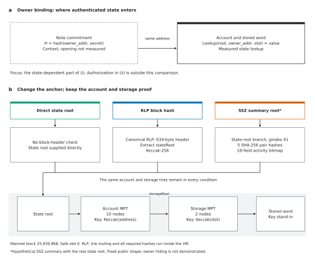
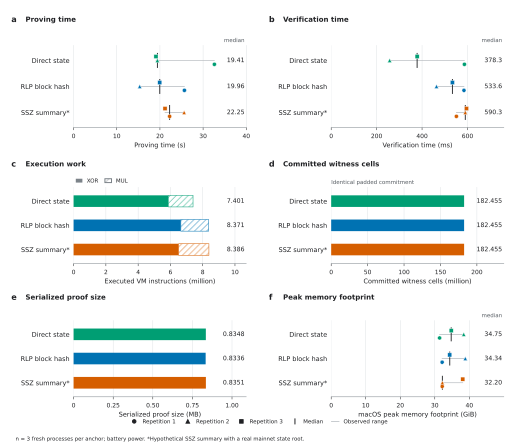

# Real proof figures

Two publication figures for the real account-and-storage experiment. Both are 183 mm wide, with editable text, embedded TrueType fonts in PDF, a colorblind-accessible palette, and 0.4-0.9 pt lines. The SVG and PDF files retain vector lines and text; 600 dpi PNGs provide high-resolution previews. The design follows [Nature's figure preparation guidance](https://research-figure-guide.nature.com/figures/building-and-exporting-figure-panels/).

## Figure 1 | One real claim through three anchor paths



[Vector PDF](figure-1-proof-paths.pdf) · [Editable SVG](figure-1-proof-paths.svg) · [600 dpi PNG](figure-1-proof-paths.png)

**Figure 1. One real account-and-storage claim through three public anchors.** **a,** A directly supplied state root, the historical RLP block hash, and a hypothetical EIP-7807 SSZ summary root authenticate the same mainnet state root. The RLP path validates the canonical 634-byte header, extracts `stateRoot`, and computes Ethereum Keccak-256. The SSZ path verifies five SHA-256 pair hashes at generalized index 41, including the 18-field activity bitmap. The SSZ root is an explicitly hypothetical summary containing the real state root, not the historical mainnet block's SSZ hash. **b,** The common inclusion relation authenticates Safe account `0xb235f9b71000a39c25476f7ba40aaa3763287685` through ten Merkle Patricia trie (MPT) nodes, extracts the account's `storageRoot`, and authenticates slot 0 through two storage trie nodes. The value is the singleton address `0x29fcb43b46531bca003ddc8fcb67ffe91900c762`, left-padded to 32 bytes. Lookup-key hashing, canonical RLP checks, compact-path checks, branch selection, node hashing, and value equality are constrained inside leanVM-b. The witness encoding shape is public and fixed. Anchor freshness or consensus validity is supplied externally; the proof establishes inclusion relative to the specified anchor.

Size: **183 × 115 mm**. Diagram numbers come from the recorded fixture, public profile, and program metadata. Full addresses and roots appear in the [experiment report](../README.md).

## Figure 2 | Real proof measurements



[Vector PDF](figure-2-measured-results.pdf) · [Editable SVG](figure-2-measured-results.svg) · [600 dpi PNG](figure-2-measured-results.png) · [Source data CSV](source-data.csv)

**Figure 2. Additional anchor work preserves the padded commitment size in these programs.** **a,b,** Proving and verification times for three fresh processes per anchor. Every sample is shown; marker shape identifies the repetition, black ticks mark medians, and thin gray lines span the observed minimum and maximum. Repetition orders were direct/RLP/SSZ, SSZ/direct/RLP, and RLP/SSZ/direct. Repetitions are sequential collections of separate processes, not simultaneous paired measurements. No samples or warmups were discarded. Proving includes guest execution and witness generation; program generation, loading, and assembly are excluded. Verification timing begins after assembly. **c,** Executed VM instructions, decomposed into XOR (solid) and MUL (hatched). The totals also include 132 SET instructions and one JUMP per program, too small to resolve at this scale. RLP and SSZ execute 13.09% and 13.30% more instructions than the direct path. **d,** All programs commit 182,455,228 witness cells under identical padded table sizes. **e,** Serialized proof size, in decimal MB (1 MB = 1,000,000 bytes). The value is constant across the three recorded runs for each path; the proof bytes themselves need not be identical. **f,** Peak memory footprint reported by macOS for each process, in GiB (1 GiB = 2³⁰ bytes). This is a different measurement from maximum resident memory. All axes begin at zero.

Size: **183 × 157 mm**. Runs used an Apple M5 Max with 128 GiB RAM, macOS 26.5, Rust/Cargo 1.97.1, and eleven Rayon workers, on **battery power**. All nine proofs verified. The three-sample ranges are descriptive, not confidence intervals, and their overlap and variation do not establish a reliable timing ranking. This experiment uses a fixed public encoding shape and an explicitly hypothetical SSZ summary. It is separate from the original AC-powered BLAKE3 calibration.

## Data and reproduction

Every plotted measurement comes from the nine preserved `results/*-prove-*.txt` logs. [source-data.csv](source-data.csv) includes all samples, their chronological positions, exact instruction counts, memory measurements, source paths, and SHA-256 hashes. The generator checks its summaries against the recorded summary CSV before plotting. No measurements were recollected or changed to make these figures.

From the repository root, with Python 3.13:

```bash
python -m pip install -r requirements-lock.txt
python -m pip install -r real_state/figure-requirements.txt
python -m real_state.plot_figures
python -m real_state.plot_figures --check
python -m real_state.verify_artifacts
```

[plot_figures.py](../plot_figures.py) builds the SVG, PDF, and PNG exports from one source. `--check` regenerates in a temporary directory and compares the source CSV and both SVG files against the committed versions. The evidence manifest covers every export. CI runs the same figure check alongside the experiment's existing verification. PDF and PNG files are not compared across platforms because rendering libraries can produce different byte encodings; their recorded files remain protected by the manifest.

Body text is 5.3-7 pt; panel letters are 8 pt. DejaVu Sans is included with Matplotlib, which keeps the rendering reproducible without proprietary system fonts. PDF font embedding and rendered-page layout were checked before publication. The original calibration figures remain in the repository's top-level [figures directory](../../figures/README.md).
