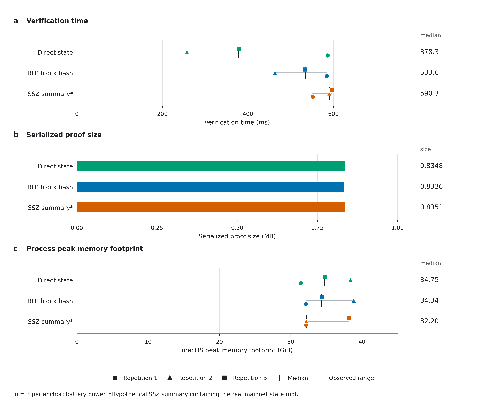

# Figures: state lookup for note-owner binding

Two main figures focus on the state-dependent part of owner binding, item (i): how an anchor authenticates an owner's account and stored word, and how that choice changes measured work. Supplementary Figure S1 retains verification time, proof size and memory. The note-commitment opening is context, not measured; signature and recursive authorization are outside the selected scope.

All figures are 183 mm wide, with editable text, embedded TrueType fonts in PDF, a colorblind-accessible palette and vector lines. The layout and exports follow [Nature's figure preparation guidance](https://research-figure-guide.nature.com/figures/building-and-exporting-figure-panels/). The 600 dpi PNGs are convenient previews; the PDFs and SVGs are the vector masters.

## Figure 1 | State lookup for owner binding


[Vector PDF](figure-1-proof-paths.pdf) · [Editable SVG](figure-1-proof-paths.svg) · [600 dpi PNG](figure-1-proof-paths.png)

**Figure 1. The state lookup needed for note-owner binding.** **a,** The motivating relation opens `H = hash(owner_addr, secret)` and uses the same address to select an account and its stored verification key. The dashed commitment box and address link describe this intended composition; the experiment measures only the solid state-lookup box. It does not constrain the note opening or demonstrate owner hiding. Signature or recursive authorization against the retrieved key is outside the selected scope. **b,** Three anchors authenticate the same mainnet state root. The direct path supplies that root. The RLP path validates the canonical 634-byte header, extracts `stateRoot` and computes Ethereum Keccak-256. The SSZ path verifies five SHA-256 pair hashes at generalized index 41, including the 18-field activity bitmap. Its summary is hypothetical and contains the real state root; it is not a historical mainnet SSZ block.

The shared lookup authenticates Safe account `0xb235f9b71000a39c25476f7ba40aaa3763287685` through ten Merkle Patricia trie (MPT) nodes and slot 0 through two storage-trie nodes. The authenticated account record supplies the storage root. The resulting singleton address `0x29fcb43b46531bca003ddc8fcb67ffe91900c762`, left-padded to 32 bytes, stands in for a verification key hash. Lookup-key hashing, canonical RLP checks, compact paths, branch selection, node hashing and value equality are enforced inside leanVM-b for a fixed public encoding shape. Anchor validity and freshness are supplied externally.

Size: **183 × 149 mm**. Structural values come from the recorded fixture, public profile and program metadata. The [report](../README.md) gives the exact public statement and fixture.

## Figure 2 | Anchor work and proving cost


[Vector PDF](figure-2-measured-results.pdf) · [Editable SVG](figure-2-measured-results.svg) · [600 dpi PNG](figure-2-measured-results.png) · [Source data CSV](source-data.csv)

**Figure 2. The block anchors add about 13% more instructions without increasing the padded commitment size.** **a,** Executed VM instructions for the same state lookup. Gray bars mark the direct-state total of 7,401,439 instructions. Colored extensions show the net increase relative to this baseline: 969,084 for RLP (+13.09%) and 984,418 for SSZ (+13.30%). These are differences between whole programs, not timings or profiles of isolated hash kernels. The labels inside the bars are total instructions; the percentages use the direct total as denominator. **b,** All three programs commit 182,455,228 witness cells under identical padded table sizes. The additional instructions fit within the existing padding. This explains why that cost driver stays fixed, but does not imply identical wall-clock cost. **c,** Every proving-time measurement, with black median ticks and thin gray lines spanning observed minima and maxima. Marker shape identifies repetition 1, 2 or 3. Each measurement comes from a fresh process; repetitions are sequential collections, not simultaneous pairs. The medians are 19.414, 19.964 and 22.247 seconds for direct, RLP and SSZ, respectively. All quantitative axes begin at zero.

Size: **183 × 127 mm**. There are three samples per anchor and all nine proofs verified. Run orders were direct/RLP/SSZ, SSZ/direct/RLP and RLP/SSZ/direct. No samples or warmups were discarded. Proving includes execution, witness generation and proof construction; program generation, loading and assembly are excluded. The machine was an Apple M5 Max with 128 GiB RAM, macOS 26.5, Rust/Cargo 1.97.1 and eleven Rayon workers, on **battery power**. The observed ranges are descriptive, not confidence intervals. The sample count and variation do not establish a reliable anchor ranking. The approximately 20-second medians describe this initial Boolean implementation, not an intrinsic cost of owner binding or an optimized hash implementation. The SSZ summary is hypothetical.

## Supplementary Figure S1 | Verification, size and memory



[Vector PDF](figure-s1-resources.pdf) · [Editable SVG](figure-s1-resources.svg) · [600 dpi PNG](figure-s1-resources.png) · [Source data CSV](source-data.csv)

**Supplementary Figure S1. Supporting measurements for the same state lookup.** **a,** Verification time after assembly, showing all three samples per anchor. **b,** Serialized proof size in decimal MB (1 MB = 1,000,000 bytes). Exact sizes are 834,848 bytes for direct, 833,632 for RLP and 835,136 for SSZ, constant across the recorded runs within each condition. Display labels are rounded; proof contents need not be identical. **c,** Every macOS peak-memory-footprint measurement in GiB (1 GiB = 2³⁰ bytes). This process metric differs from maximum resident memory, which is also preserved in the logs. Black ticks and numerical labels show medians in panels a and c; gray lines show observed ranges. All quantitative axes start at zero. Marker meanings, run order and environment match Figure 2.

Size: **183 × 151 mm**. These measurements describe the account-and-storage program, without note-commitment opening or authorization. They are separate from the earlier AC-powered BLAKE3 calibration.

## Data and reproduction

Every measured value comes from the nine preserved `results/*-prove-*.txt` logs. [source-data.csv](source-data.csv) includes every sample, its chronological position, exact instruction counts, memory measurements, source path and SHA-256 hash. The generator checks raw measurements against the recorded summary before plotting and computes the added instruction counts directly from those totals. No measurements or proof programs changed for this presentation update.

From the repository root, with Python 3.13:

```bash
python -m pip install -r requirements-lock.txt
python -m pip install -r real_state/figure-requirements.txt
python -m real_state.plot_figures
python -m real_state.plot_figures --check
python -m real_state.verify_artifacts
```

[plot_figures.py](../plot_figures.py) builds all exports from one source. `--check` regenerates the source CSV and all three SVG files in a temporary directory and compares them to the recorded files. CI runs the same check. The evidence manifest covers every export; PDF and PNG bytes are not compared across platforms because rendering libraries can encode them differently.

Body text is 5.5-7 pt and panel letters are 8 pt. DejaVu Sans ships with Matplotlib, providing reproducible typography without proprietary fonts. PDF font embedding and rendered-page layout were checked before publication. The earlier calibration figures remain in the [original gallery](../../figures/README.md).
